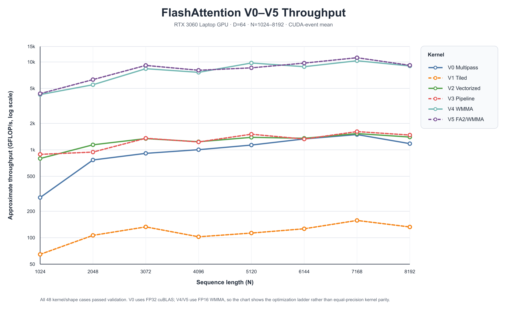

# FlashAttention CUDA Kernel Lab

A forward-pass attention project that derives online softmax, removes the quadratic score/probability workspace, and incrementally optimizes a fused CUDA kernel through vectorized memory access, asynchronous pipelines, and WMMA Tensor Cores.

This repository is intentionally a kernel-engineering project rather than a drop-in replacement for production FlashAttention. It includes correctness checks, reproducible benchmarks, a PyTorch extension, and explicit scope constraints.

## Highlights

- Implements the complete progression from a materialized cuBLAS baseline to fused online-softmax attention.
- Reduces auxiliary storage from `O(N²)` score/probability matrices to an `O(N·D)` streaming path.
- Uses `float4` vectorized loads, warp shuffles, shared-memory tiling, double buffering with `cp.async`, and FP16 WMMA.
- Validates output against an independent CPU safe-softmax reference.
- Provides a deterministic CLI with kernel filtering, adaptive timing, CSV output, and stable/experimental kernel separation.
- Exposes the stable V4 kernel as a PyTorch extension with dtype, shape, device, contiguity, and current-stream checks.
- Includes a validated FA2-style V5 path plus an explicitly experimental split/reduce decoding prototype.

## Kernel progression

| Version | Technique | Purpose |
| --- | --- | --- |
| V0 Multipass | cuBLAS + materialized scores/softmax | Correctness and `O(N²)` memory baseline |
| V1 Tiled | Fused online softmax | Eliminate quadratic intermediates |
| V2 Vectorized | Register fragments, `float4`, warp shuffle | Reduce shared-memory traffic |
| V3 Pipeline | Double-buffered K/V tiles | Overlap global-memory loads and compute |
| V4 WMMA | FP16 Tensor Core matrix products | Raise matrix-multiply throughput |
| V5 FA2/WMMA | 64-wide K/V tiles, warp-owned query rows, double buffering | Stable FA2-style forward path |
| Flash decoding | Split partial states + online reduction | Experimental single-query decoding path |

See [Architecture](docs/architecture.md) for data flow and invariants, and [Optimization notes](docs/optimization-notes.md) for the full derivation.

## Quick start

Requirements: Linux or WSL2, CUDA Toolkit 12.x, an Ampere-or-newer NVIDIA GPU, and GNU Make.

```bash
make CUDA_ARCH=86
make smoke
./build/attention_bench --list-kernels
./build/attention_bench --n 8192 --kernel V4 --target-ms 200
```

Run the full stable optimization ladder at one shape:

```bash
make test-stable
```

Run the V5 regression matrix and the experimental decoding kernel:

```bash
make test-v5
./build/attention_bench --n 1024 --kernel decoding --include-experimental
```

The CUDA kernels currently require `D=64` and sequence lengths divisible by 64. Unsupported shapes fail with a clear error rather than silently producing partial output.

## Measured results

On an RTX 3060 Laptop GPU (`sm_86`), a unified V0--V5 sweep with three warmups, a 200 ms adaptive timing window, deterministic seed 42, and validation enabled produced the following `N=1024, D=64` results:

| Kernel | Time | Approx. throughput | Validation |
| --- | ---: | ---: | --- |
| V0 Multipass | 0.937 ms | 0.287 TFLOP/s | PASS |
| V1 Tiled | 4.155 ms | 0.065 TFLOP/s | PASS |
| V2 Vectorized | 0.337 ms | 0.797 TFLOP/s | PASS |
| V3 Pipeline | 0.302 ms | 0.889 TFLOP/s | PASS |
| V4 WMMA | 0.063 ms | 4.254 TFLOP/s | PASS |
| V5 FA2/WMMA | 0.062 ms | 4.359 TFLOP/s | PASS |

The full sweep covers eight sequence lengths from `N=1024` through `N=8192`: all 48 kernel/shape cases passed validation. At `N=1024`, V5 is about 15.2× faster than the materialized V0 baseline. At `N=8192`, V4 and V5 reach 9.01 and 9.17 TFLOP/s respectively. The sweep stops at 8192 because V0 alone allocates two FP32 `N×N` intermediates (512 MiB total at that shape); the fused kernels can scale much further. V0--V3 use FP32 while V4/V5 use FP16 WMMA, so the chart represents the optimization ladder rather than equal-precision kernel parity.

Raw measurements, correctness output, and the captured environment are available in [`result/v0_v5_benchmark.csv`](result/v0_v5_benchmark.csv), [`result/v0_v5_validation.log`](result/v0_v5_validation.log), and [`result/v0_v5_environment.txt`](result/v0_v5_environment.txt). The logarithmic y-axis keeps all six implementations visible despite their wide performance range.

At `N=62,464`, two FP32 `N×N` intermediates alone would require roughly 31.2 GB. The FP16 fused path stores about 32 MB for Q/K/V/O, excluding small on-chip tiles—why the fused implementation can run this shape on a 6 GB GPU while V0 cannot.



Benchmark numbers depend on clocks, power limits, driver/library versions, and GPU exclusivity. See [Benchmarking protocol](docs/benchmarking.md) before comparing results.

## PyTorch extension

Install a PyTorch build matching the local CUDA toolchain, then build and test:

```bash
python3 setup.py build_ext --inplace
python3 -m pytest -q tests
```

```python
import torch
import my_flash_attn

q = torch.randn(4096, 64, device="cuda", dtype=torch.float16)
k = torch.randn_like(q)
v = torch.randn_like(q)
output = my_flash_attn.run_v5(q, k, v)
```

The extension launches on PyTorch's current CUDA stream. It is forward-only and supports one `[N, 64]` head per call.

## Repository map

```text
attention.cu               CUDA kernels and launchers
main.cu                    native benchmark and CPU validation harness
reference.cu               independent safe-softmax CPU reference
wrapper.cpp                checked PyTorch binding and stream integration
tests/test_extension.py    PyTorch correctness and contract tests
benchmarks/benchmark_torch.py
                            comparison with PyTorch SDPA
scripts/run_benchmark.sh   environment-capturing reproducible run
docs/architecture.md       kernel/data-flow design
docs/benchmarking.md       measurement contract and caveats
docs/v5-design.md          FA2-style work partition and validation
docs/optimization-notes.md detailed derivation and experiments
```

## Scope and roadmap

The stable API does not yet implement batching, multiple heads, causal masking, arbitrary head dimensions, backward propagation, dropout, or ragged sequences. High-value next steps are a layout supporting bank-conflict-free WMMA loads, batched/head indexing, causal masking, and a backward kernel followed by an end-to-end transformer workload.
