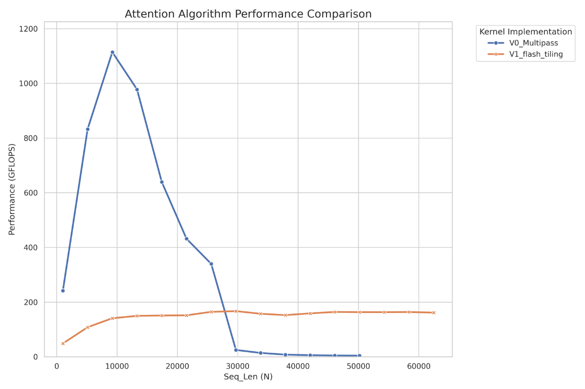
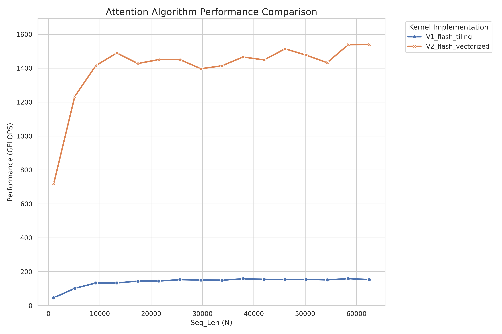
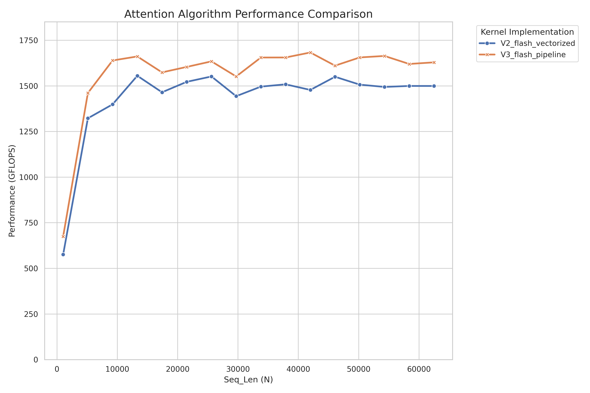

# Flash-attention 实现记录

## 朴素实现

Attention公式: 

$$
Attention(Q, K, V) = softmax\left(\frac{QK^T}{\sqrt{d}}\right)V \qquad (1)
$$

其中 $Q, K, V$ 的 shape 都是 $(N, d)$，这个计算过程涉及到两个中间矩阵，分别是：

$$
S = \frac{QK^T}{\sqrt{d}} \qquad (2)
$$

$$
P = softmax(S) \qquad (3)
$$

在实际的操作当中，因为 softmax 涉及的指数乘法很容易产生溢出，所以必须采用 safe-softmax 算法（下面提到的 softmax 默认都是 safe-softmax），即：

$$
m_i = \max_{j = 1}^{i} (x_j) , l_i = \sum_{j = 1}^{i} e^{x_j - m_N} 
$$

$$
softmax({x_i}) = \frac{e^{x_i - m_N}}{l_N} \qquad (4)
$$

因此最简单的实现就是按照 attention 的公式一步一步来：

```cpp
__global__ void softmax_v0_kernel(float* S, float* P, int N) {
    int row = blockIdx.x * blockDim.x + threadIdx.x;
    if (row >= N) return;

    size_t row_offset = (size_t)row * N; 
    float maxval = -CUDART_INF_F;
    float sum = 0.0;

    for (int i = 0; i < N; ++i) {
        maxval = max(maxval, S[row_offset + i]);
    }
    for (int i = 0; i < N; ++i) {
        sum += exp(S[row_offset + i] - maxval);
    }
    for (int i = 0; i < N; ++i) {
        P[row_offset + i] = exp(S[row_offset + i] - maxval) / sum;
    }
}

void launch_v0_cublas(cublasHandle_t handle, const float* Q, const float* K, const float* V, float* O, float* S, float* P, int N, int d) {
    float alpha = 1.0f / sqrtf((float)d);
    float beta = 0.0f;

    // 1. S = (1/sqrt(d)) * Q * K^T
    cublasSgemm(handle, CUBLAS_OP_T, CUBLAS_OP_N, N, N, d, &alpha, K, d, Q, d, &beta, S, N);

    // 2. P = Softmax(S)
    int threads = 256;
    int blocks = (N + threads - 1) / threads;
    softmax_v0_kernel<<<blocks, threads>>>(S, P, N);
    
    // 3. O = P * V
    float alpha_1 = 1.0f;
    cublasSgemm(handle, CUBLAS_OP_N, CUBLAS_OP_N, d, N, N, &alpha_1, V, d, P, N, &beta, O, d);
}
```

因为是最朴素的实现，只是为了检验思路正确性，所以矩阵乘法直接调用 cublas 库内的实现，`cublasSgemm` 的参数列表是 *(handle, 第一个矩阵是否转置, 第二个矩阵是否转置, 内积维度, 维度A, 维度B, alpha, 矩阵A, 矩阵A领先维度(实际上就是行长度), 矩阵B, 矩阵B领先长度, beta, 输出矩阵, 输出矩阵领先长度)* 。

这里要注意 `cublasSgemm` 内部默认传入的矩阵是列主序的，也就是说当我们向其传入或者传出矩阵的时候，这个矩阵都会被自动转置一次，为了适应这种逻辑，我们需要对 (1) 式子进行一些变形：

$$
S = \frac{QK^T}{\sqrt{d}} \rightarrow S^T = \frac{KQ^T}{\sqrt{d}} \qquad (5)
$$

所以第一个矩阵是转置后的 $K$（我们指定一次转置，然后传入又会有一次转置，$K^{TT}=K$），第二个矩阵是 $Q$，第三个矩阵是 $S$。

其它部分就是按照公式一步一步来，这边就已经可以看出朴素实现的低效之处了：首先是 $P$ 和 $S$ 的 shape 都是 $(N, N)$，因此会带来 $\mathcal{O}(N^2)$ 的空间复杂度；其次是 softmax 公式要求行的最大值，因为必须有一次单独的遍历，目的只是找出每行的最大值。

## online-softmax

上面所说的两个问题的根源实际上是一样的，就是我们在计算的时候必须预先要先得知 $P$ 矩阵的所有信息，于是很自然地，我们考虑是否有一种方法可以实现边读取边计算 (online) 呢？下面介绍的 online-softmax 就是为了解决这个问题：

$$
\begin{aligned}
\text{令 } l'_i &= \sum_{j = 1}^{i} e^{x_j - m_i} \\
\text{可得 } l'_i &= \sum_{j = 1}^{i} e^{x_j - m_i} \\
                &= \sum_{j = 1}^{i-1} e^{x_j - m_i} + e^{x_i - m_i}\\
                &= e^{m_{i-1} - m_i} \cdot \sum_{j= 1}^{i-1} e^{x_j - m_{i - 1}} + e^{x_i - m_i} \\
                &= e^{m_{i-1} - m_i} \cdot l'_{i-1} + e^{x_i - m_i}
\end{aligned}
$$

可以看到 $l'_i$ 的递归形式仅仅依赖 $l'_{i-1}, m_{i-1}$ 和 $m_i$，因此可以在一个循环内同时计算 $m_i$ 和 $l'_i$。

online-softmax 的步骤如下:

$$
\begin{aligned}
&\textbf{for } i \leftarrow 1, N \textbf{ do} \\
&\left| \begin{aligned}
    &\quad m_i \leftarrow \max(m_{i-1}, x_i) \\
    &\quad l'_i \leftarrow l'_{i-1} e^{m_{i-1}-m_i} + e^{x_i-m_i}
\end{aligned} \right. \\
&\textbf{end} \\
&\textbf{for } i \leftarrow 1, N \textbf{ do} \\
&\left| \begin{aligned}
    &\quad a_i \leftarrow \frac{e^{x_i - m_N}}{l'_N}
\end{aligned} \right. \\
&\textbf{end}
\end{aligned}
$$

这个算法解决了需要额外进行一次遍历进行最大值的计算的问题，实现了 $l$ 和 $m$ 的并行。
但是计算 $a$ 仍然需要一次额外的循环，我们接下来的问题是，如何消除这个循环，实现真正的 online。

单从这个式子比较难下手，但是如果我们不是一个一个计算 $a_i$，而是考虑一整段区间内的性质，会得到不同的视角。

## 从 online-softmax 到 flash-attention

我们用上面得到的新公式重新解释 attention 公式 $Attention(Q, K, V) = softmax(QK^T)V$。下面把 $Attention(Q, K, V)$ 用 $O$ 简写，针对 $O$ 当中的第 $k$ 行，计算过程如下:

$$
\begin{aligned}
&\textbf{for } i \leftarrow 1, N \textbf{ do} \\
&\left| \begin{aligned}
    &\quad x_i \leftarrow Q[k, :] * K^T[:, i] \\
    &\quad m_i \leftarrow \max(m_{i-1}, x_i) \\
    &\quad l'_i \leftarrow l'_{i-1} e^{m_{i -1} - m_i} + e^{x_i - m_i}
\end{aligned} \right. \\
&\textbf{end} \\
&\textbf{for } i \leftarrow 1, N \textbf{ do} \\
&\left| \begin{aligned}
    &\quad a_i \leftarrow \frac{e^{x_i - m_N}}{l'_N} \\
    &\quad o_i \leftarrow o_{i - 1} + a_i * V[i, :] \hspace{2em} \textbf{(这是对 O 第 k 行的迭代过程)}
\end{aligned} \right. \\
&\textbf{end} \\
&\textbf{O}[k,:] \leftarrow o_N
\end{aligned}
$$

我们对计算 $O_i$ 的式子进行变形，代入 $a_i = \frac{e^{x_i - m_N}}{l'_N}$，可得 $O_i = \sum_{j = 1}^{i} \left(\frac{e^{x_j - m_N}}{l'_N} V[j,:]\right)$。

同样的，这个式子依赖 $m_N$ 和 $l'_N$，这两个变量都需要循环结束才能得到值，我们仿照之前的方法创建一个序列 $o'$:

$$
\begin{aligned}
o'_i &= \sum_{j=1}^{i} \left( \frac{e^{x_j - m_i}}{l'_i} V[j, :] \right) \\
&= \sum_{j=1}^{i-1} \frac{e^{x_j - m_i}}{l'_i} V[j, :]  + \frac{e^{x_i - m_i}}{l'_i} V[i, :] \\
&= \frac{l'_{i-1}}{l'_i} \cdot e^{m_{i-1} - m_i} \cdot \sum_{j=1}^{i-1} \frac{e^{x_j - m_{i-1}}}{l'_{i-1}} \cdot V[j, :]  + \frac{e^{x_i - m_i}}{l'_i} V[i, :] \\
&= o'_{i-1} \frac{l'_{i-1}}{l'_i} e^{m_{i-1} - m_i} + \frac{e^{x_i - m_i}}{l'_i} V[i, :]
\end{aligned}
$$

综合上述公式，我们可以得到完整的 flash-attention 算法：

$$
\begin{aligned}
&\textbf{for } i \leftarrow 1, N \textbf{ do} \\
&\left| \begin{aligned}
    &x_i \leftarrow Q[k, :] * K^T[:, i] \\
    &m_i \leftarrow \max(m_{i-1}, x_i) \\
    &l'_i \leftarrow l'_{i-1} e^{m_{i-1}-m_i} + e^{x_i-m_i} \\
    &o'_i \leftarrow o'_{i-1} \frac{l'_{i-1}}{l'_i} e^{m_{i-1}-m_i} + \frac{e^{x_i-m_i}}{l'_i} V[i, :]
\end{aligned} \right. \\
&\textbf{end} \\
&\hspace{2em} O[k, :] \leftarrow o'_N
\end{aligned}
$$

状态 $o, l', m$ 和 $x$ 占用的空间很小，可以比较轻松的放入 GPU 的 shared_mem 中。由于此算法中的所有操作都是满足结合性的，因此它与 tiling 兼容，我们可以逐块计算状态。

$$
\begin{aligned}
&\textbf{New Notations} \\
&b : \text{the block size of the tile} \\
&N_{tiles} : \text{number of tiles in the row, } N = b * N_{tiles} \\
&x_i : \text{a vector storing the } Q * K^T \text{ value of i-th tile } [(i-1)b : ib] \\
&m_i^{(local)} : \text{the local maximum value inside } x_i. \\
&\textbf{Body} \\
&\textbf{for } i \leftarrow 1, N_{tiles} \textbf{ do} \\
&\left| \begin{aligned}
    &x_i \leftarrow Q[k, :] K^T [:, (i-1)b : ib] \\
    &m_i^{(local)} = \max_{j=1}^b (x_i[j]) \\
    &m_i \leftarrow \max(m_{i-1}, m_i^{(local)}) \\
    &l'_i \leftarrow l'_{i-1} e^{m_{i-1}-m_i} + \sum_{j=1}^b e^{x_i[j]-m_i} \\
    &o'_i \leftarrow o'_{i-1} \frac{l'_{i-1}}{l'_i} e^{m_{i-1}-m_i} + \sum_{j=1}^b \frac{e^{x_i[j]-m_i}}{l'_i} V[j + (i-1)b, :]
\end{aligned} \right. \\
&\textbf{end} \\
&\hspace{2em} O[k, :] \leftarrow o'_{N_{tiles}}
\end{aligned}
$$

## v1_flash_tiling算法: 初步实现flash-attention

根据上面的算法流程，写出v1版本的flash-attention kernel：

```cpp
__global__ void flash_attn_v1_kernel(
    const float* Q, const float* K, const float* V, float* O,
    int N, int d, int Tc, int Tr, int Bc, int Br, float scale
) {
    extern __shared__ float sram[];
    float* s_Q = sram;
    float* s_K = s_Q + Br * d;
    float* s_V = s_K + Bc * d;

    int tx = threadIdx.x;
    int bx = blockIdx.x;
    int row_idx = bx * Br + tx;

    if (row_idx >= N) return;

    float m_i = -CUDART_INF_F;
    float l_i = 0.0f;

    float o_reg[64];
    #pragma unroll
    for (int k = 0; k < d; ++k) o_reg[k] = 0.0f;

    for (int i = tx; i < Br * d; i += blockDim.x) {
        s_Q[i] = Q[bx * Br * d + i];
    }

    __syncthreads();

    for (int j = 0; j < Tc; ++j) {
        for (int k = tx * 4; k < Bc * d; k += blockDim.x * 4) {
            // 这边的K是还没有进行转置的
            *(float4*)(&s_K[k]) = *(float4*)(&K[j * Bc * d + k]);
            *(float4*)(&s_V[k]) = *(float4*)(&V[j * Bc * d + k]);
        }
        __syncthreads();

        #pragma unroll
        for (int curr_bc = 0; curr_bc < Bc; ++curr_bc) {
            float sum = 0.0f;
            #pragma unroll
            for (int k = 0; k < d; ++k) {
                sum += s_Q[tx * d + k] * s_K[curr_bc * d + k];
            }
            sum *= scale;

            float m_prev = m_i;
            m_i = max(m_prev, sum);

            float alpha = expf(m_prev - m_i);
            float beta = expf(sum - m_i);

            l_i = l_i * alpha + beta;

            // 重放缩旧的 O 并加上新的 PV 贡献
            for (int k = 0; k < d; ++k) {
                o_reg[k] = o_reg[k] * alpha + beta * s_V[curr_bc * d + k];
            }
        }
        __syncthreads(); // 准备进入下一个 KV 块
    }

    // 6. 最终归一化并写回 HBM
    for (int k = 0; k < d; ++k) {
        O[row_idx * d + k] = o_reg[k] / l_i;
    }
}
```

这边我们没有采用公式里面那么复杂的方式来更新o1，而是采用分子分母同时计算，最后综合的方式，可以证明这两种方法是完全等价的，而且实际上代码里面的这种方法更加符合flash-attention这种“块缩放”思想的直觉，对计算单元也更加友好(少了很多除法次数)。

我们比较v1算法和朴素算法的性能表现，数据规模是N=1024到62464，步长4096：



可以发现朴素算法在小规模数据上速度比v1算法更快，这是因为v1算法的矩阵乘是手写的，而朴素算法是调库，性能更优。但是在数据规模增大之后，朴素算法的性能产生了断崖式下跌，这边明显是遇到了访存瓶颈，体现了O(N^2)复杂对于算法性能的毁灭性打击。然后到了N=50000多的关口，朴素算法直接爆显存崩溃了，而v1算法虽然慢，但是在什么数据规模下都能平稳运行。

## v2_flash_vectorized算法：向量化读取+寄存器私有数据

v2的优化思路是把Q矩阵当中需要用到的值读取到thread私有的寄存器里面，这样可以避免在不同tile的循环当中，每次都要向shared_mem发起读请求，一个block有128个线程，所对应的区域是O当中的Br*d=32 \*64的区域，所以将这个区域划分成四块8\*64的区域，先由一个block当中的所有线程共同把这块Q搬运到s_Q里面，然后再将自己对应的那一块s_Q读取到register内，之后计算的时候只用register内的这一段数据进行计算。

v2算法相比于v1，把一整行Q划分到了四个threads当中，但是最终在计算S的时候，仍然需要Q的一整行信息，如何实现threads之间的信息交换呢？我们可以使用__shfl_xor_sync函数:

```cpp
static inline float __shfl_xor_sync(unsigned int mask, float var, int laneMask, int width = 32)
```

这个函数的执行分为两部分，首先每个线程会向外分享自己的var值，然后会读取threadId为threadIdx.x^laneMask的线程的这个var值，作为函数的返回值。第一个参数mask是一个32位值，某一位置为1代表对应的线程会参与这个交换，width代表总共参与的线程数，最大值和默认值为32。

为了进行相邻四个线程内部的交换，我们可以采用蝴蝶式交换：

```cpp
float S_ij = partial_sum; // partial_sum是当前线程的寄存器内值计算得到的结果
S_ij += __shfl_xor_sync(0xffffffff, S_ij, 1);
S_ij += __shfl_xor_sync(0xffffffff, S_ij, 2);
```

全部算法代码如下：

```cpp
__global__ void flash_attn_v2_kernel(
    const float* Q, const float* K, const float* V, float* O,
    int N, int d, int Tc, int Tr, int Bc, int Br, float scale
) {
    int tx = threadIdx.x;
    int bx = blockIdx.x;

    // 这个线程所负责的行
    int row_id = tx / 4; // 范围: 0-31（对应Br的行索引）
    int lane_id = tx % 4; // 范围: 0-3（对应一行内的四个分段）
    int col_offset = lane_id * 16; // 范围: [0, 16, 32, 48]（每个分段的起始位置）

    extern __shared__ char dynamic_sram[];
    float* sram = (float*)dynamic_sram;
    float* s_Q = sram;
    float* s_K = s_Q + Br * d;
    float* s_V = s_K + Bc * d;

    float q_frag[16];
    float k_frag[16];
    float v_frag[16];
    float o_reg[16] = {0.0f};

    float m_i = -CUDART_INF_F;
    float l_i = 0.0f;

    // 阶段1：先从global_mem里面搬运Q到shared_mem的s_Q当中，然后读取到线程私有的寄存器当中
    load_global_to_shared(Q, s_Q, Br, d, bx, tx);
    __syncthreads();

    float4* s_Q_ptr = (float4*)(&s_Q[row_id * d + col_offset]);
    *(float4*)(&q_frag[0]) = s_Q_ptr[0];
    *(float4*)(&q_frag[4]) = s_Q_ptr[1];
    *(float4*)(&q_frag[8]) = s_Q_ptr[2];
    *(float4*)(&q_frag[12]) = s_Q_ptr[3];
    #pragma unroll
    for (int i = 0; i < 16; ++i) q_frag[i] *= scale;

    // 阶段2
    for (int j = 0; j < Tc; ++j) {
        load_global_to_shared_2(K, s_K, Bc, d, j, tx, V, s_V);
        __syncthreads();

        for (int t = 0; t < Bc; ++t) {
            float4* s_K_ptr = (float4*)(&s_K[t * d + col_offset]);
            *(float4*)(&k_frag[0]) = s_K_ptr[0];
            *(float4*)(&k_frag[4]) = s_K_ptr[1];
            *(float4*)(&k_frag[8]) = s_K_ptr[2];
            *(float4*)(&k_frag[12]) = s_K_ptr[3];

            float sum_partial = 0.0f;
            #pragma unroll
            for (int i = 0; i < 16; ++i) {
                sum_partial += q_frag[i] * k_frag[i];
            }

            float S_ij = sum_partial;
            S_ij += __shfl_xor_sync(0xffffffff, S_ij, 1);
            S_ij += __shfl_xor_sync(0xffffffff, S_ij, 2);

            float m_prev = m_i;
            m_i = max(m_prev, S_ij);
            
            float alpha = expf(m_prev - m_i);
            float exp_S = expf(S_ij - m_i);
            l_i = l_i * alpha + exp_S;

            // 5. 加载 V 片段并更新 O 累加器
            float4* s_V_ptr = (float4*)(&s_V[t * d + col_offset]);
            *(float4*)(&v_frag[0])  = s_V_ptr[0];
            *(float4*)(&v_frag[4])  = s_V_ptr[1];
            *(float4*)(&v_frag[8])  = s_V_ptr[2];
            *(float4*)(&v_frag[12]) = s_V_ptr[3];

            #pragma unroll
            for (int i = 0; i < 16; ++i) {
                o_reg[i] = o_reg[i] * alpha + exp_S * v_frag[i];
            }
        }

        __syncthreads();
    }

    #pragma unroll
    for (int i = 0; i < 16; ++i) {
        o_reg[i] /= l_i;
    }

    // 2. 直接向量化写回 (HBM)
    // 对应 O 的 (bx*Br + row_id) 行，col_offset 列开始的 16 个元素
    float4* O_ptr = (float4*)(&O[(bx * Br + row_id) * d + col_offset]);
    O_ptr[0] = *(float4*)(&o_reg[0]);
    O_ptr[1] = *(float4*)(&o_reg[4]);
    O_ptr[2] = *(float4*)(&o_reg[8]);
    O_ptr[3] = *(float4*)(&o_reg[12]);
}
```

算法性能如下，有一定程度提升，不过距离高性能仍然差很多，一个问题是没有加入double buffering，导致在每个tile循环内，在从global mem加载数据的时候fma单元都在空等，另一个问题是for循环的矩阵计算还是太低效了，需要后续使用tensor core来改善：



## v3_flash_pipeline算法：加入double buffering掩盖延迟

pipeline算法就是加入double buffering，来实现在读取下一个tile的同时进行上一个tile的计算，还是一样的preload->main loop->epilogue:

```cpp
__global__ void flash_atten_v3_kernel(
    const float* Q, const float* K, const float* V, float* O,
    int N, int d, int Tc, int Tr, int Bc, int Br, float scale
) {
    int tx = threadIdx.x;
    int bx = blockIdx.x;

    int row_id = tx / 4; // 范围: 0-31（对应Br的行索引）
    int lane_id = tx % 4; // 范围: 0-3（对应一行内的四个分段）
    int col_offset = lane_id * 16; // 范围: [0, 16, 32, 48]（每个分段的起始位置）

    // 在pipeline读取当中，s_K和s_V的shape都是[2][Bc][d]
    extern __shared__ char dynamic_sram[];
    float* sram = (float*)dynamic_sram;
    float* s_Q = sram;
    float* s_K = s_Q + Br * d;
    float* s_V = s_K + 2 * Bc * d;
    int write_stage = 0;
    int read_stage = 0;

    float q_frag[16];
    float k_frag[16];
    float v_frag[16];
    float o_reg[16] = {0.0f};

    float m_i = -CUDART_INF_F;
    float l_i = 0.0f;

    load_global_to_shared(Q, s_Q, Br, d, bx, tx);
    __syncthreads();
    float4* s_Q_ptr = (float4*)(&s_Q[row_id * d + col_offset]);
    *(float4*)(&q_frag[0]) = s_Q_ptr[0];
    *(float4*)(&q_frag[4]) = s_Q_ptr[1];
    *(float4*)(&q_frag[8]) = s_Q_ptr[2];
    *(float4*)(&q_frag[12]) = s_Q_ptr[3];
    #pragma unroll
    for (int i = 0; i < 16; ++i) q_frag[i] *= scale;

    // preload: 发送第一条读K和V的请求
    load_global_to_shared_async(write_stage, K, s_K, Bc, d, 0, tx);
    load_global_to_shared_async(write_stage, V, s_V, Bc, d, 0, tx);
    __pipeline_commit();

    write_stage ^= 1;

    // 处理中间的K和V读取
    for (int j = 1; j < Tc; ++j) {
        load_global_to_shared_async(write_stage, K, s_K, Bc, d, j, tx);
        load_global_to_shared_async(write_stage, V, s_V, Bc, d, j, tx);
        __pipeline_commit();

        __pipeline_wait_prior(1);

        __syncthreads();

        // 对读取到的K和V进行计算
        for (int t = 0; t < Bc; ++t) {
            float4* s_K_ptr = (float4*)(s_K + read_stage * Bc * d + t * d + col_offset);
            *(float4*)(&k_frag[0]) = s_K_ptr[0];
            *(float4*)(&k_frag[4]) = s_K_ptr[1];
            *(float4*)(&k_frag[8]) = s_K_ptr[2];
            *(float4*)(&k_frag[12]) = s_K_ptr[3];

            float sum_partial = 0.0f;
            #pragma unroll
            for (int i = 0; i < 16; ++i) {
                sum_partial += q_frag[i] * k_frag[i];
            }

            float S_ij = sum_partial;
            S_ij += __shfl_xor_sync(0xffffffff, S_ij, 1);
            S_ij += __shfl_xor_sync(0xffffffff, S_ij, 2);

            float m_prev = m_i;
            m_i = max(m_prev, S_ij);
            
            float alpha = expf(m_prev - m_i);
            float exp_S = expf(S_ij - m_i);
            l_i = l_i * alpha + exp_S;

            float4* s_V_ptr = (float4*)(s_V + read_stage * Bc * d + t * d + col_offset);
            *(float4*)(&v_frag[0])  = s_V_ptr[0];
            *(float4*)(&v_frag[4])  = s_V_ptr[1];
            *(float4*)(&v_frag[8])  = s_V_ptr[2];
            *(float4*)(&v_frag[12]) = s_V_ptr[3];

            #pragma unroll
            for (int i = 0; i < 16; ++i) {
                o_reg[i] = o_reg[i] * alpha + exp_S * v_frag[i];
            }
        }


        write_stage ^= 1;
        read_stage ^= 1;
        __syncthreads();
    }

    // 处理最后的K和V读取
    __pipeline_wait_prior(0);
    __syncthreads();

    for (int t = 0; t < Bc; ++t) {
        float4* s_K_ptr = (float4*)(s_K + read_stage * Bc * d + t * d + col_offset);
        *(float4*)(&k_frag[0]) = s_K_ptr[0];
        *(float4*)(&k_frag[4]) = s_K_ptr[1];
        *(float4*)(&k_frag[8]) = s_K_ptr[2];
        *(float4*)(&k_frag[12]) = s_K_ptr[3];

        
        float sum_partial = 0.0f;
        #pragma unroll
        for (int i = 0; i < 16; ++i) {
            sum_partial += q_frag[i] * k_frag[i];
        }

        float S_ij = sum_partial;
        S_ij += __shfl_xor_sync(0xffffffff, S_ij, 1);
        S_ij += __shfl_xor_sync(0xffffffff, S_ij, 2);

        float m_prev = m_i;
        m_i = max(m_prev, S_ij);
        
        float alpha = expf(m_prev - m_i);
        float exp_S = expf(S_ij - m_i);
        l_i = l_i * alpha + exp_S;

        float4* s_V_ptr = (float4*)(s_V + read_stage * Bc * d + t * d + col_offset);
        *(float4*)(&v_frag[0])  = s_V_ptr[0];
        *(float4*)(&v_frag[4])  = s_V_ptr[1];
        *(float4*)(&v_frag[8])  = s_V_ptr[2];
        *(float4*)(&v_frag[12]) = s_V_ptr[3];

        #pragma unroll
        for (int i = 0; i < 16; ++i) {
            o_reg[i] = o_reg[i] * alpha + exp_S * v_frag[i];
        }
    }

    #pragma unroll
    for (int i = 0; i < 16; ++i) {
        o_reg[i] /= l_i;
    }

    // 2. 直接向量化写回 (HBM)
    // 对应 O 的 (bx*Br + row_id) 行，col_offset 列开始的 16 个元素
    float4* O_ptr = (float4*)(&O[(bx * Br + row_id) * d + col_offset]);
    O_ptr[0] = *(float4*)(&o_reg[0]);
    O_ptr[1] = *(float4*)(&o_reg[4]);
    O_ptr[2] = *(float4*)(&o_reg[8]);
    O_ptr[3] = *(float4*)(&o_reg[12]);
}
```

相比于v2也有少许的提升，不过不多，可以看出来主要瓶颈还是在低效的矩阵计算上面，我们面临的应该是计算瓶颈，而不是访存瓶颈：



## v4_flash_wmma：引入tensor core进行计算

